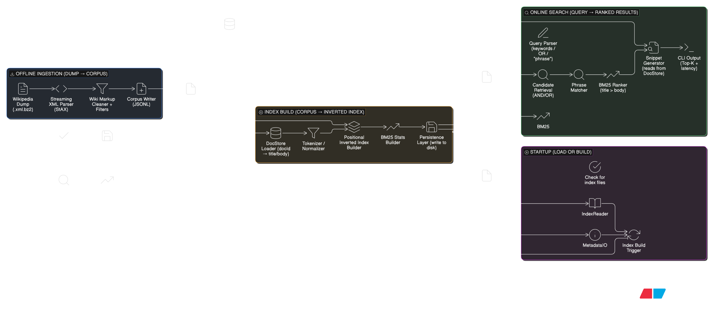

# Wiki-Search (Java)

A lightweight search engine built from scratch in **Java** that indexes Wikipedia articles and supports fast ranked retrieval with **BM25**, **AND/OR queries**, and **phrase search** using a **positional inverted index**.

This project focuses on real backend + systems fundamentals:
- streaming parsing
- inverted indexing
- ranking
- persistence to disk
- scalability (50k docs)

---

## Features

### Dump ingestion
- Parses Wikipedia XML dumps using **StAX streaming parser**
- Supports compressed dumps: **`.xml.bz2`**
- Filters only main namespace articles (`ns = 0`)
- Skips redirect pages
- Best-effort wiki markup cleaning for better snippets and indexing

## Architecture




### Indexing
- **Positional Inverted Index**
  - stores term → (docId → positions[])
- Separate indexes:
  - Title index
  - Body index

### Query Support
- Keyword search (default **AND**)
- Explicit OR queries
  - Example: `india OR pakistan`
- Phrase queries using term positions
  - Example: `"machine learning"`
- Snippets for readable preview

### Ranking
- **BM25**
- Title matches are boosted relative to body matches
- Phrase match boosts for better relevance

### Disk Persistence
- Index written to disk:
  - `output/title_index.txt`
  - `output/body_index.txt`
- Index metadata written to disk:
  - `output/index_meta.json` (doc lengths, averages, total docs)
- Auto startup behavior:
  - If files exist → load from disk
  - Else → build from JSONL and save

---

## Dataset

This project uses **Simple English Wikipedia** official dumps:

- `simplewiki-latest-pages-articles.xml.bz2`

✅ Recommended: keep dump files **outside the Git repo**

Example location:
D:\devProjs\data\wiki\simplewiki-latest-pages-articles.xml.bz2

---

## Benchmarks (50,000 docs)

Results from indexing a 50k-document corpus:

- Index build time: ~6–9 seconds
- Disk write time: ~2–3 seconds
- Typical query time: ~1–10 ms

(Will vary depending on CPU, disk, RAM, and JVM.)

---

## Project Layout

src/main/java/com/shaswat/
ingest/ # Wikipedia dump parser + cleaning -> JSONL
preprocess/ # tokenizer + normalization
index/ # inverted index, metadata, writer/reader
query/ # query parsing (AND/OR/phrase)
search/ # search engine + ranking (BM25) + phrase matching
store/ # doc store for title/body lookup
tools/ # GenerateJsonl utility


---

## How to Run

### 1) Generate JSONL (one-time)
This creates:
- `output/wiki_docs.jsonl`

```bash
mvn clean compile exec:java -Dexec.mainClass="com.shaswat.tools.GenerateJsonl"


Optional: supply custom arguments:

mvn clean compile exec:java -Dexec.mainClass="com.shaswat.tools.GenerateJsonl" \
  -Dexec.args="D:/path/to/dump.xml.bz2 output/wiki_docs.jsonl 50000"

2) Run Search CLI

This will:

load index from disk if present

otherwise build index from JSONL and persist it

mvn clean compile exec:java -Dexec.mainClass="com.shaswat.Main"

Example Queries

india

cricket

"machine learning"

india OR pakistan

"computer science"

Example output:

QUERY: india
Query time: 6 ms
1) India   score=22.34
   India is a country in South Asia...

Key Design Decisions
Why positional indexing?

Storing term positions enables:

phrase queries ("machine learning")

proximity search (future upgrade)

Why separate title and body indexes?

Title matches are stronger intent signals

Boosting title field improves result quality

Why persist index to disk?

indexing Wikipedia is expensive

persistence makes repeat runs instant and reproducible

Future Improvements

Stopword removal + stemming

Better wiki markup parsing (nested templates)

Index compression (gap encoding / varints)

Spring Boot API + React UI demo

Relevance evaluation (Precision@K, Recall)

License

MIT (or your preferred license)


---

## Final step: commit
```powershell
git add README.md src/main/java/com/shaswat/tools/GenerateJsonl.java
git commit -m "Add README and improve JSONL generator tool"
git push

